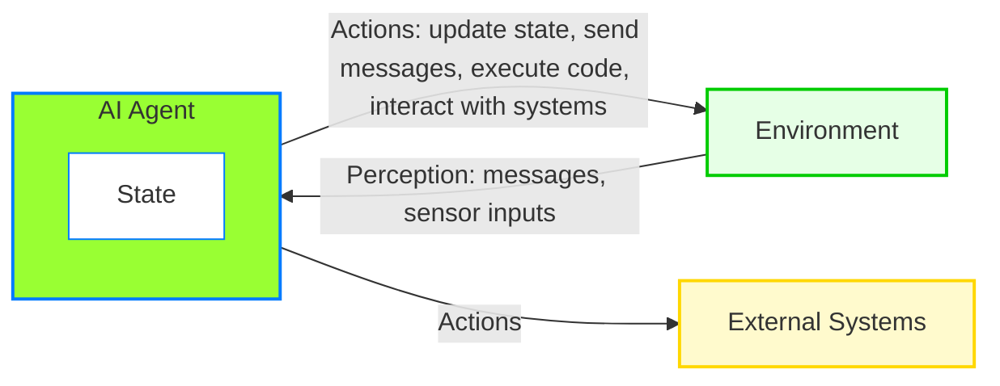
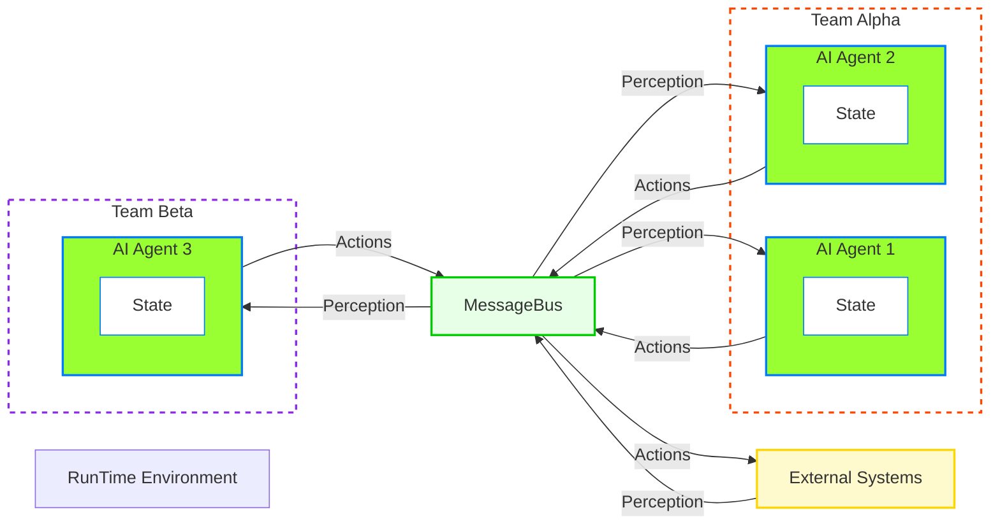

# Model Runtime

Let's review this PTO Request process one more time.

An employee wants to take PTO next Thursday and Friday to enjoy a long weekend. Here’s the basic flow:

-   An LLM calculates the dates for next week.
-   The employee checks their PTO balance and submits a request.
-   The request goes to the manager for approval.
-   The manager, aware it’s a long weekend, ensures not all staff are off at once and approves based on team availability.
-   Once approved, the employee’s department and teammates working on the same tasks are notified.

```{mermaid}
flowchart TD
    A((Start)) --> B[Calculate dates]
    B --> C[Check PTO balance]
    C --> D[Submit PTO request]
    D --> E[Manager reviews PTO request]
    E --> F[Check team availability]
    F --> G[Approve PTO request]
    G --> H[Send notifications]
    H --> I((End))

    style A fill:#e0f7fa,stroke:#000
    style B fill:#f1f8e9,stroke:#000
    style C fill:#e0f7fa,stroke:#000
    style D fill:#f1f8e9,stroke:#000
    style E fill:#e0f7fa,stroke:#000
    style F fill:#f1f8e9,stroke:#000
    style G fill:#e0f7fa,stroke:#000
    style H fill:#f1f8e9,stroke:#000
    style I fill:#e0f7fa,stroke:#000
```

## Actor & State
To handle tasks like approving Employee's time off request, we need a simple setup like an Actor model to simulate state and behavior.
State of Agent will hold data and properties while behavior methods will manage tasks such as if Employee asks for a day off. The system must check her remaining vacation days, find her supervisor, look at her tasks, and send the request to her manager. This involves several agents—think of them as helpers—talking to each other a lot.



## Virtual Environment

We need a `virtual environment`, like a separate workspace, to manage these actor model state, helper methods, their tools, and how they work together. It’s similar to programming, where you keep all the software pieces organized in one place to avoid confusion.

Similar to functional programming, where managing various packages and dependencies is crucial, it becomes vital to oversee a project's critical dependencies within a single, dedicated environment. Additionally, properly managing namespaces is essential for ensuring efficient program execution.

## Agent RunTime
Now you can imagine, just to respond to this simple task to perform PTO request, There is need of multiple agents, processes and hence multiple message communication is required back and forth before Agent can respond with accurate information and take appropriate actions.

what is Agent `runtime` anyway? At the foundation level, the framework provides a runtime environment, which facilitates communication between agents, manages their identities and lifecycles, and enforce security and privacy boundaries.

For now, we will just focus on messages flowing in a `runtime` environment and will deal with agent identities, lifecycle, security, privacy and models later.

## Agent RunTime environment

The change we want to see involves, how one agent maintain its state and communicate with external systems and other agents.

Instead of relying on 1:1 direct messaging, all communication will occur through a common message bus. 

For now, the primary role of this message bus is to facilitate a shared communication channel among different agents, whether they belong to the same team or different teams.

As this `message bus` will evolve into `runtime`, will include more features such as agent identities, lifecycle, security, privacy and models etc..




just for the reference, here are diagrams (ref: [AutoGen Documentation](https://microsoft.github.io/autogen/stable/user-guide/core-user-guide/core-concepts/architecture.html)) showing the standalone and distributed runtime in the framework.

## Agent Runtime


## Distributed Agent Runtime
