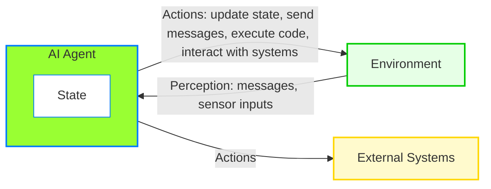
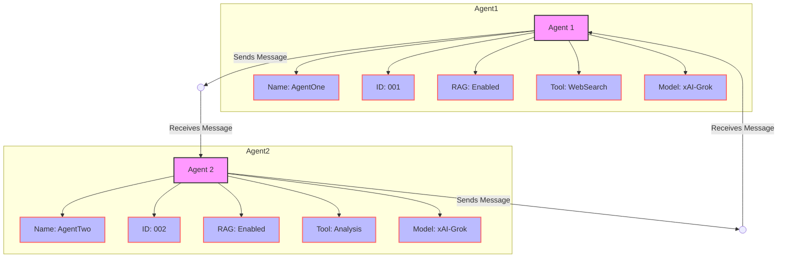

# Actor Model

In this and the following section, we focus on the core concepts of AutoGen: agents, agent runtime, messages, and communication – the foundational building blocks for an multi-agent applications.

Let's create an AI Agent and see what it does.

First of all, An Agent is a software entity like an Actor, designed to operate autonomously. An AI agent maintains its own state, perceives its environment (e.g., through messages or sensor inputs), and takes actions to achieve specific goals. These actions—such as updating its state, sending messages, executing code, or interacting with external systems—can influence both the agent and its surroundings. 

Unlike typical software components, AI agents often exhibit intelligent behaviors, such as learning from experience, adapting to changes, or making decisions in uncertain conditions.

In essence, an AI agent is a goal-directed entity that interacts with its environment, blending autonomy with intelligence (such as interpret messages, perform reasoning, and execute actions). Many sophisticated software systems can be modeled as collections of such agents, each pursuing its objectives while collaborating or competing with others.

## AI Agent

Just to re-iterate, an Agent is a software entity like an Actor, designed to operate autonomously. Let's define an An Autonomous actor Agent.



```{note} from AutoGen Documentation
The Core API is designed to be unopinionated and flexible. So at times, you may find it challenging. Continue if you are building an interactive, scalable and distributed multi-agent system and want full control of all workflows. If you just want to get something running quickly, you may take a look at the AgentChat API.

If you just want to see something running, there is no need to go through rest of this chapter and < 10 lines of code will spin a live AI Assistant for you.
```

```python
# sample code just for reference
# running AI Agents in < 10 lines of code
# pip install -U "autogen-agentchat" "autogen-ext[openai]"
import asyncio
from autogen_agentchat.agents import AssistantAgent
from autogen_ext.models.openai import OpenAIChatCompletionClient

async def main() -> None:
    agent = AssistantAgent("assistant", OpenAIChatCompletionClient(model="gpt-4o"))
    print(await agent.run(task="Say 'Hello World!'"))

asyncio.run(main())
```

> Proceed with AutoGen Core, with the understanding that we want to develop a complete AI Agent Framework to support a complex business use case where we intend to have complete control over the entire workflow.

## what is actor model?

```{note} from wiki
The actor model in computer science is a mathematical model of concurrent computation that treats an actor as the basic building block of concurrent computation.

In response to a message it receives, an actor can: make local decisions, create more actors, send more messages, and determine how to respond to the next message received. Actors may modify their own private state, but can only affect each other indirectly through messaging (removing the need for lock-based synchronization).
```

## AI Agent Implementation

Stand alone implementation of an AI Agent

```python
class MyFirstAgent():
    def __init__(self) -> None:
        super().__init__()

    def do_something(self, message: str) -> None:
        print(f"received message: {message}")

FirstAgent = MyFirstAgent()
FirstAgent.do_something("Hello World!")
```

```{seealso} result
    received message: Hello World!
```

```python
# standalone implementation of an AI Agent
# add Agent identifier

class MyFirstAgent:
    def __init__(self, name: str, agent_id: str, property: str) -> None:
        self.name = name
        self.agent_id = agent_id
        self.property = property
        # No arguments needed for object.__init__()
        super().__init__()

    def do_something(self, message: str) -> None:
        print(f"received message: {message}")

    def get_something(self, message: str) -> None:
        print(f"Pretend it's incoming message: {message}")

    def set_something(self, message: str) -> None:
        print(f"Pretend it's outcoming message: {message}")

    def run_something(self, message: str) -> None:
        print(f"Pretend this is coming from a API given a query: {message}")            

# Instantiate the agent with name and agent_id
FirstAgent = MyFirstAgent("APIGuy", "AgentID123", "runs API")
print(FirstAgent.do_something("Hello World!"))
print(FirstAgent.name, FirstAgent.agent_id, FirstAgent.property)
```

```{seealso} result
    received message: Hello World!
    None
    APIGuy AgentID123 runs API
```

So, we created our first AI Agent, but this is nothing but a simple Python OOPs class, there is some Agentic characteristics we built here.
We gave it an identity, name and it does something. This Agent, let's say is an API Agent.
but if you think about it, what is Agentic, An Agent has an identity and able to communicate (lets say, send and receive data aka messages).

so for now, let's give this Agent a unique identity and then enable this agent with a mechanism to send and receive data (aka messages), We will worry about making it more intelligent in later steps.

let's create another sample agent.

```python
# standalone implementation of an AI Agent
# add Agent identifier
# add Agent behavior

class MySecondAgent:
    def __init__(self, name: str, agent_id: str, 
                property: str, model: str, 
                tools: str, RAG: str) -> None:
        self.name = name
        self.agent_id = agent_id
        self.property = property
        self.model = model # assume llama3.3
        self.tools = tools # assume a Tool Function
        self.RAG = RAG # assume ChromaDB
        # No arguments needed for object.__init__()
        super().__init__()

    def do_something(self, message: str) -> None:
        print(f"received message: {message}")

    def get_something(self, message: str) -> None:
        # self.model
        # use llama3.3 LLM model
        print(f"Pretend it's incoming message: {message}")

    def set_something(self, message: str) -> None:
        # self.RAG
        # use RAG to write data into
        print(f"Pretend it's outcoming message: {message}")

    def run_something(self, message: str) -> None:
        # self.tools
        # use tools to run a function
        print(f"Pretend this is coming from a LLM given a prompt: {message}")            

# Instantiate the agent with name and agent_id
SecondAgent = MySecondAgent("LLMGuy", "AgentID124", 
                            "runs LLM inference", "llama3.2", 
                            "ChromaDB", "exmToolFunc")
print(SecondAgent.do_something("Hello World!"))
print(SecondAgent.name, SecondAgent.agent_id, SecondAgent.property)
```

```{seealso} result
    received message: Hello World!
    None
    LLMGuy AgentID124 runs LLM inference
```



As you can see, these two agents can maintain their state, represented as an Actor model, and exchange data in the form of messages with each other.

However, in real life, it's not this simple. Here is a graph of 10 such agents, and you can imagine how cluttered this graph will look if you have more than 10 agents, which is often the case in real-life scenarios.

```mermaid
graph TD
    subgraph Agent1
        A1[Agent 1]
        A1 --> A1_name[Name: AgentOne]
        A1 --> A1_id[ID: 001]
        A1 --> A1_rag[RAG: Enabled]
        A1 --> A1_tool[Tool: WebSearch]
        A1 --> A1_model[Model: xAI-Grok]
    end

    subgraph Agent2
        A2[Agent 2]
        A2 --> A2_name[Name: AgentTwo]
        A2 --> A2_id[ID: 002]
        A2 --> A2_rag[RAG: Enabled]
        A2 --> A2_tool[Tool: Analysis]
        A2 --> A2_model[Model: xAI-Grok]
    end

    subgraph Agent3
        A3[Agent 3]
        A3 --> A3_name[Name: AgentThree]
        A3 --> A3_id[ID: 003]
        A3 --> A3_rag[RAG: Enabled]
        A3 --> A3_tool[Tool: DataProcessing]
        A3 --> A3_model[Model: xAI-Grok]
    end

    subgraph Agent4
        A4[Agent 4]
        A4 --> A4_name[Name: AgentFour]
        A4 --> A4_id[ID: 004]
        A4 --> A4_rag[RAG: Enabled]
        A4 --> A4_tool[Tool: MachineLearning]
        A4 --> A4_model[Model: xAI-Grok]
    end

    subgraph Agent5
        A5[Agent 5]
        A5 --> A5_name[Name: AgentFive]
        A5 --> A5_id[ID: 005]
        A5 --> A5_rag[RAG: Enabled]
        A5 --> A5_tool[Tool: NaturalLanguageProcessing]
        A5 --> A5_model[Model: xAI-Grok]
    end

    subgraph Agent6
        A6[Agent 6]
        A6 --> A6_name[Name: AgentSix]
        A6 --> A6_id[ID: 006]
        A6 --> A6_rag[RAG: Enabled]
        A6 --> A6_tool[Tool: ImageRecognition]
        A6 --> A6_model[Model: xAI-Grok]
    end

    subgraph Agent7
        A7[Agent 7]
        A7 --> A7_name[Name: AgentSeven]
        A7 --> A7_id[ID: 007]
        A7 --> A7_rag[RAG: Enabled]
        A7 --> A7_tool[Tool: SpeechRecognition]
        A7 --> A7_model[Model: xAI-Grok]
    end

    subgraph Agent8
        A8[Agent 8]
        A8 --> A8_name[Name: AgentEight]
        A8 --> A8_id[ID: 008]
        A8 --> A8_rag[RAG: Enabled]
        A8 --> A8_tool[Tool: PredictiveAnalytics]
        A8 --> A8_model[Model: xAI-Grok]
    end

    subgraph Agent9
        A9[Agent 9]
        A9 --> A9_name[Name: AgentNine]
        A9 --> A9_id[ID: 009]
        A9 --> A9_rag[RAG: Enabled]
        A9 --> A9_tool[Tool: SentimentAnalysis]
        A9 --> A9_model[Model: xAI-Grok]
    end

    subgraph Agent10
        A10[Agent 10]
        A10 --> A10_name[Name: AgentTen]
        A10 --> A10_id[ID: 010]
        A10 --> A10_rag[RAG: Enabled]
        A10 --> A10_tool[Tool: AnomalyDetection]
        A10 --> A10_model[Model: xAI-Grok]
    end

    A1 -->|Sends Message| M1(( ))
    M1 -->|Receives Message| A2
    A2 -->|Sends Message| M2(( ))
    M2 -->|Receives Message| A1
    A3 -->|Sends Message| M3(( ))
    M3 -->|Receives Message| A4
    A4 -->|Sends Message| M4(( ))
    M4 -->|Receives Message| A3
    A5 -->|Sends Message| M5(( ))
    M5 -->|Receives Message| A6
    A6 -->|Sends Message| M6(( ))
    M6 -->|Receives Message| A5
    A7 -->|Sends Message| M7(( ))
    M7 -->|Receives Message| A8
    A8 -->|Sends Message| M8(( ))
    M8 -->|Receives Message| A7
    A9 -->|Sends Message| M9(( ))
    M9 -->|Receives Message| A10
    A10 -->|Sends Message| M10(( ))
    M10 -->|Receives Message| A9

    classDef agent fill:#f9f,stroke:#333,stroke-width:2px;
    class A1,A2,A3,A4,A5,A6,A7,A8,A9,A10 agent
    classDef prop fill:#bbf,stroke:#f66,stroke-width:2px;
    class A1_name,A1_id,A1_rag,A1_tool,A1_model,A2_name,A2_id,A2_rag,A2_tool,A2_model,A3_name,A3_id,A3_rag,A3_tool,A3_model,A4_name,A4_id,A4_rag,A4_tool,A4_model,A5_name,A5_id,A5_rag,A5_tool,A5_model,A6_name,A6_id,A6_rag,A6_tool,A6_model,A7_name,A7_id,A7_rag,A7_tool,A7_model,A8_name,A8_id,A8_rag,A8_tool,A8_model,A9_name,A9_id,A9_rag,A9_tool,A9_model,A10_name,A10_id,A10_rag,A10_tool,A10_model prop
```


