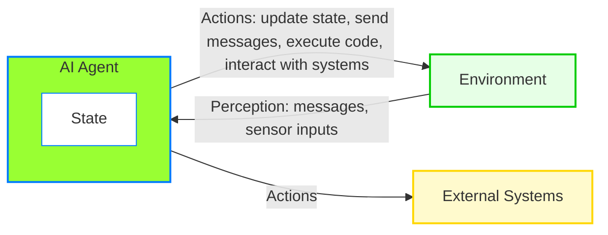
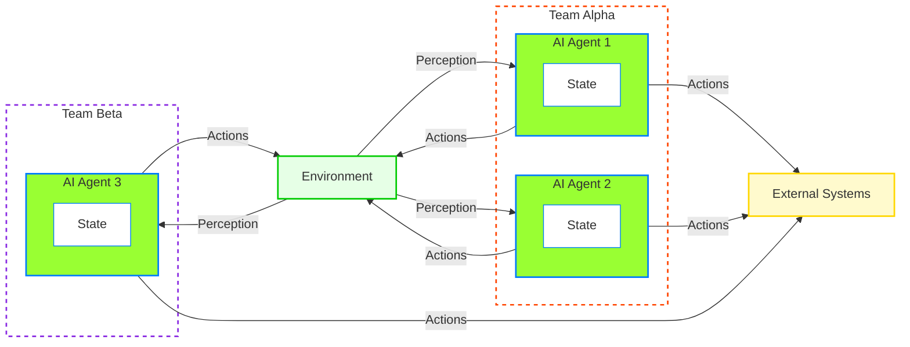

# Definition

Now since we have written many many tools, let's use these tools to LLM and ask questions.

```python
tools = ["get_pto_hours", "get_assignments", "get_manager_info"]
response = ollama.chat(
        model='llama3.2',
        messages=[{'role': 'tool', 'content': 
            """how many PTO Alice had taken in past two weeks and
             how many projects are assigned to her, who is her manager?
             """}],
             ## refer to chapter: Tools -> More Tool Functions
		    ## provide tool functions
        tools=tools # type: ignore
    )

# response 
print(f"\nInitial Response:")
print(f"Tool called: {response["message"]["tool_calls"][0]}")
print(f"Tool name: {response["message"]["tool_calls"][0]["function"]["name"]}")
print(f"Tool param: {response["message"]["tool_calls"][0]["function"]["arguments"]}")
print(f"Stop Reason: {response["done_reason"]}")
print(f"Content: {response["message"]["content"]}")
```

so what's just happened here,

When working with Large Language Models (LLMs), a common challenge arises with their tool or function-calling capabilities. Specifically, confusion creeps in when there are numerous tools available, when tools have overlapping or similar purposes, or when a single prompt demands the use of multiple tools to generate a complete answer. This can lead to the LLM selecting the wrong tool, misinterpreting the prompt, or failing to coordinate multiple tools effectively.

One obvious solution might be to create additional tools that combine the functionalities of existing ones to address these complex scenarios. However, this approach has a significant drawback: it undermines the very flexibility and dynamism that make LLMs and their tool-calling abilities so powerful. If we keep building combination tools for every possible situation, we end up with a bloated, rigid system that loses its adaptability—defeating the purpose of having a versatile LLM in the first place.

So, how do we address this issue without compromising the core strengths of LLMs? The key lies in developing a smarter mechanism to manage and utilize tool-calling capabilities more effectively. Here are a few strategies that could help:

- Intelligent Tool Orchestration
- Enhanced Tool Reasoning
- Tool Planning Module
- Contextual Prompt Design
- Learning from Feedback

In short, the future of LLM tool-calling lies in intelligent management, not endless expansion. With the right approach, we can unlock their full potential without sacrificing flexibility.

Just using tools and functions is not enough for professional software as a service (SaaS) solutions design.

## Single AI Agent
In software development, there are many ways to write code, known as programming paradigms.

Some developers use object-oriented programming (OOP), where code is organized around objects that combine data and behavior. Others prefer functional programming, which focuses on pure functions and immutable data and some like Multiple Dispatch Type based programming.

Additionally, certain languages offer duck typing—a dynamic typing feature that enhances flexibility by allowing objects to be used based on their capabilities rather than their explicit types. 

No single paradigm is universally best; each has unique strengths and weaknesses suited to different challenges.

These patterns make code more manageable, extensible, and clear.

From a coder’s perspective, a frequent objective is to create software components that maintain their own state, process inputs, and interact with other components. This principle holds across paradigms and applications, whether building a simple module or a complex system.

> Now, consider an AI agent in this light:

It’s a software entity like an Actor, designed to operate autonomously. An AI agent maintains its own state, perceives its environment (e.g., through messages or sensor inputs), and takes actions to achieve specific goals. These actions—such as updating its state, sending messages, executing code, or interacting with external systems—can influence both the agent and its surroundings. 

Unlike typical software components, AI agents often exhibit intelligent behaviors, such as learning from experience, adapting to changes, or making decisions in uncertain conditions.

In essence, an AI agent is a goal-directed entity that interacts with its environment, blending autonomy with intelligence (such as interpret messages, perform reasoning, and execute actions). Many sophisticated software systems can be modeled as collections of such agents, each pursuing its objectives while collaborating or competing with others.

```{note}
When we see examples of code, it becomes clearer what it means for an AI Agent to be self-sufficient, independent, and event driven run time environment. If above defintions, analogies aren't clear yet, these will become more clear as we write code.
```



## Multi Agents

How Multi-Agent Systems Differ from Single AI Agents

A single AI agent is like one smart program that works alone to handle all tasks. A multi-agent system, however, is a team of AI programs, where each has its own role, and they work together to achieve a common goal. Here’s how they differ, explained simply with examples.

**What’s a Single AI Agent?**
A single AI agent is one program doing everything by itself. For example:
Imagine a robot vacuum cleaner that maps your house, avoids obstacles, and cleans the floor—all on its own. It’s smart, but it’s limited to what one program can manage.

**What’s a Multi-Agent System?**
A multi-agent system is a group of AI programs (agents) that team up. Each agent has a specific job, and they communicate to get things done. For example:
In a smart home, one agent controls the lights, another adjusts the thermostat, and a third monitors the security camera. If the security agent spots someone at the door, it tells the lights agent to brighten the porch.

Unlike a single agent, multi-agent systems split the work, making them more efficient and flexible.



In the next few chapters, we will explore the AI Agents design pattern to accomplish useful tasks.  

Let’s start by considering what we already know about large language models (LLMs), tools, and functions. How can we use this knowledge to define an AI agent, Let’s break down what a basic AI agent is and what it can do.

```{note}
For now, we don’t need to use fancy tools or programs like Agent Chat, Agent Studio, Open AI Swarm, MultiAgent, Magentic-core, AI Agents Single Chat, or MultiChat workflows—these are like design patterns, and we’ll keep it simple instead.

Initially, we want to build one Simple AI Agent, You can always use AI Agent Chat to quickly build an AI Agent, but Agent Chat is nothing but a preset AI Agents ready to use.

knowing AutoGen Core is important because it will help you understand and build own custom AI Agents, which are event-driven, distributed, scalable, resilient and you can run these agents locally on your sytem and will scale and move to a distributed platform when ready for deployment.
```