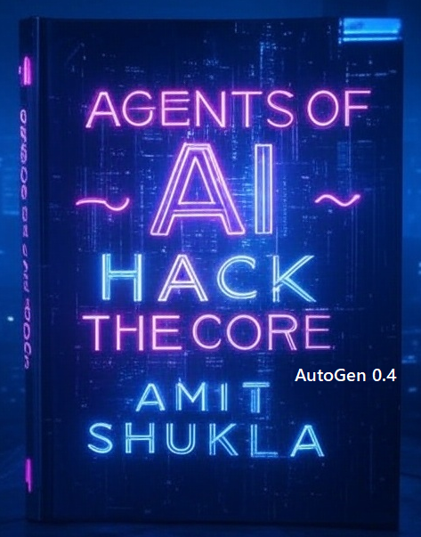

# Agents of AI

~ Hack the Core : AutoGen 0.4 Unleashed

- Author: Amit Shukla
- `x.com/@ashuklax`
- [license](../license.txt)

Welcome to my Agents of AI book, This book will teach you to code with `Microsoft AutoGen 0.4` to automate boring tasks.

These AI agents can tackle the repetitive, tiring chores you hate, as well as tasks which require fact-based smart decision making, freeing you up fast.

> This complete book is provided at no cost. Should you wish to support the development of future editions, please consider purchasing a copy, subscribing to my [YouTube](https://youtube.com/@amit.shukla) channel, following me at [X](https://x.com/@ashuklax) & [GitHub](https://github.com/AmitXShukla). Your contributions would be greatly appreciated.

# About This Book

You’ve probably heard of AI Agents unless you’ve been completely out of touch. If you’ve used tools like xAI Grok, Google Gemini, OpenAI ChatGPT, or Anthropic models for vibe coding, you may have noticed they’re shifting focus—pushing AI Agents alongside their usual services. 

In this book, `AgentsofAI ~ Hack the Core`, you’ll learn to build AI Agents, from basic to advanced, for your own projects. It’s totally free and designed to give you enough know-how to kickstart your own entrepreneurial AI venture.

So, what’s special about an AI Agent framework? First of all, It’s not here to replace LLM models; it works with them. AI Agents unlock the full power of LLMs to automate tasks, from simple ones to really tricky stuff.

Take **Open AI Operator Agents, Google Co-Scientist, Microsoft Dragon CoPilot, or Omni Parser**  screen parsing tool, they supercharge LLMs to tackle tasks or solve big business problems, cutting out boring human effort.

The book costs nothing, but if you’d like to support me, a follow on X (`x.com/@ashuklax`), GitHub (`github.com/@AmitXShukla`), or a subscription to my YouTube channel (`youtube.com/@amit.shukla`) would mean a lot and motivate me to create an even better version of this book.

Let’s dive in!