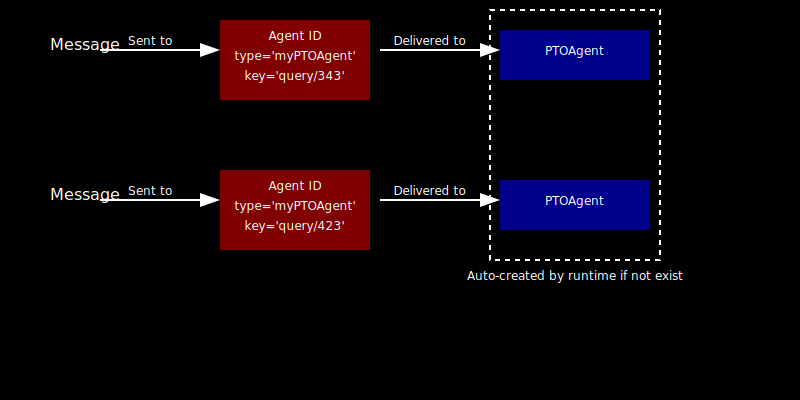

# Agent Lifecyle

In the previous chapter, we explored agents, messages, high level concept of runtime and how they effectively enable the passing of different type of messages between agents within the same or a distributed computing environment.

We explored the `runtime` environment, a system that lets programs run and supports AI agents designed with the `actor` model. We also built an example agent called `PTOAgent` and defined the `runtime` in our code. Below is a snippet of that code.

```python
## snippet of the code
## PTO Agent Actor model

from autogen_core import RoutedAgent
class PTOAgent(RoutedAgent):
    def __init__(self) -> None:
        super().__init__("ERPPTOAgent")
    @message_handler(match=lambda msg, ctx: msg.source.startswith("Manager"))
        async def on_txt_message_1(self, message: PTOAgentMessages, ctx: MessageContext) -> None:
            # fetches available PTO for a given employee
            ## added agent ID
            print(f"{self.id.type} received message: {message.content} from : {message.source}")
...
...
...
## A runtime
from autogen_core import SingleThreadedAgentRuntime
runtime = SingleThreadedAgentRuntime()
```

This code imports the `RoutedAgent` class from `autogen_core` and defines a new `PTOAgent` class that inherits from it, initializing it with the name `myPTOAgent`.

## Register an Agent

```python
from autogen_core import SingleThreadedAgentRuntime
runtime = SingleThreadedAgentRuntime()
```
This code imports a `SingleThreadedAgentRuntime` class from the `autogen_core` module and creates a runtime instance that manages agents in a single-threaded environment.

Let's attach (or `register`) the `PTOAgent` to this `runtime`.

```python
## bad code
runtime.register("PTOAgent")
```

However, In a real-life situation, I can see multiple agents, like `LLMAgent`, `ManagerAgent`, or `AnotherAgent`, using this `PTOAgent` for various tasks, such as checking PTO availability for different employees.

```{mermaid}
sequenceDiagram
    %% Adding a background box with light color
    rect rgba(200, 212, 223, 0.8)
        participant LLMAgent
        participant ManagerAgent
        participant AnotherAgent
        participant PTOAgent
        participant TaskAgent
        LLMAgent->>PTOAgent: request "Available PTO" for Employee 123
        PTOAgent-->>LLMAgent: respond with 16
        ManagerAgent->>PTOAgent: request "Available PTO" for Employee 123
        PTOAgent-->>ManagerAgent: respond with 16
        ManagerAgent->>PTOAgent: request "Available PTO" for Employee 124
        PTOAgent-->>ManagerAgent: respond with 8
        ManagerAgent->>PTOAgent: request "Available PTO" for Employee 125
        PTOAgent-->>ManagerAgent: respond with 8
        AnotherAgent->>PTOAgent: request "Available PTO" for Employee 512
        PTOAgent-->>AnotherAgent: respond with 24
        ManagerAgent->>TaskAgent: request "Assigned Tasks" for Employee 512
        TaskAgent-->>ManagerAgent: respond with TaskList
    end
```

How does registering an agent (using code `runtime.register("PTOAgent")`) with a runtime solve this? We need one `PTOAgent` that other agents can call repeatedly.
If it’s not needed, it just stays idle.

## Agent Type

If you want to reuse an agent like `PTOAgent` for various tasks without registering it repeatedly (e.g., `runtime.register("PTOAgent")` for each use), you can register an AgentType instead. This approach is more efficient and flexible.

Agent Type is not same as Agent class. In this above example, `PTOAgent` is an Agent class (Python class), initializing it with the name `ERPPTOAgent`.

**So what is the Agent Type?**

Again, The agent type is not an agent class. It associates an agent with a specific factory function, which produces instances of agents of the same agent type.

The job of Agent Type is to provide an instance of Python Agent class given a specific functions, this way, we can create many instance of same Agent Type.

## `AgentType`: A Clearer Explanation
### Key Concepts
- **Agent Class**: A Python class that defines what an agent does. For example:
  ```python
  class PTOAgent:
      def handle_pto(self):
          print("Processing PTO request")
  ```
  You can create an instance of it, like `ERPPTOAgent = PTOAgent()`.

- **Agent Instance**: A specific object made from the agent class (e.g., `ERPPTOAgent`).

- **Agent Type**: A factory function that creates instances of the agent class. It’s not the class itself but a way to produce agents on demand. For example:
  ```python
  def create_pto_agent():
      return PTOAgent()
  ```

### What’s the Point of `AgentType`?
Instead of registering every agent instance individually (e.g., `runtime.register(ERPPTOAgent)`), you register the `AgentType`—the factory function. The runtime can then call this function whenever it needs a new agent of that type. This makes it easy to create multiple agents of the same kind without redundant registrations.

### Example in Action
Here’s how it works:
```python
# Define the agent class
class PTOAgent:
    def handle_pto(self):
        print("Processing PTO request")

# Define the factory function (AgentType)
def create_pto_agent():
    return PTOAgent()

# Register the AgentType once
runtime.register_agent_type("PTOAgentType", create_pto_agent)

# Runtime creates agents as needed
agent1 = runtime.get_agent("PTOAgentType")  # New PTOAgent instance
agent2 = runtime.get_agent("PTOAgentType")  # Another PTOAgent instance

agent1.handle_pto()  # Output: Processing PTO request
agent2.handle_pto()  # Output: Processing PTO request
```

### Why It’s Better
- **Reusability**: One registration covers all instances of that agent type.
- **Flexibility**: The factory function can be customized (e.g., adding parameters):
  ```python
  def create_pto_agent(user_id):
      return PTOAgent(user_id=user_id)
  ```

### Summary
The `AgentType` is a factory function that produces agent instances, not the agent class itself. By registering an `AgentType`, you let the runtime generate as many agents as needed from a single registration—way simpler than registering each one by hand!

## Agent ID and LifeCycle

Final key concept introduced here is to put altogether, Agent, Agent Type, Agent ID and Agent Lifecycle.

Agent Types helps us create instances of an Agent Type, but how do we really associate a give Agent Type to a `runtime` to manage specific query requests from specific agents.

## Agent ID
Agent ID uniquely identifies an agent instance within an agent runtime – including distributed runtime. 

It is the “address” of the agent instance for receiving messages. 

It has two components: agent type and agent key.

> Agent ID = (Agent Type, Agent Key)

## Agent Key

The agent key is an instance identifier for the given agent type

## Agent Lifecycle



## Registering Agents

The final agent `register` code creates a unique ID for the agent to send and receive messages in the `runtime`.

```python
from autogen_core import SingleThreadedAgentRuntime

# create a standalong single thread runtime
runtime = SingleThreadedAgentRuntime()

# attach/register AI Agent to run time
await PTOAgent.register(runtime, "AgType_ERP_PTO_Agent", lambda: PTOAgent())
await TaskAgent.register(runtime, "AgType_ERP_Task_Agent", lambda: TaskAgent())
```

```{seealso} result
    AgentType(type='AgType_ERP_PTO_Agent')
    AgentType(type='AgType_ERP_Task_Agent')
```

```{note} note
Why learn about Agent ID and Lifecycle in so much detail?

Because the same agent can be reused across runtimes using different Agent Types. 

An Agent ID and Type key identifies a specific instance in a runtime, enabling reuse without complex OOP concepts like encapsulation or inheritance. 

Different Agent Types can use factory functions with varied parameters to create distinct instances of the same agent class.
```

## Executing Runtime
After registering an agent, you can message an `Agent` instance using its `AgentId`, and the `runtime` creates the instance on the first `message` delivery.

```python
runtime.start()  # Start processing messages in the background.
await runtime.send_message(PTOAgentMessages("Query PTOs taken by Employee ID 512 in past 2 weeks.", "Employee"), AgentId("AgType_ERP_PTO_Agent", "default"))
await runtime.send_message(PTOAgentMessages("Query PTOs taken by Employee ID 512 in past 2 weeks", "Manager"), AgentId("AgType_ERP_PTO_Agent", "default"))
await runtime.send_message(TaskAgentMessages("I need a list of all tasks assigned!", "Employee"), AgentId("AgType_ERP_Task_Agent", "default"))
await runtime.send_message(TaskAgentMessages("I need a list of all tasks assigned!", "Manager"), AgentId("AgType_ERP_Task_Agent", "default"))
```

```{seealso} result
    AgType_ERP_PTO_Agent received message: Query PTOs taken by Employee ID 512 in past 2 weeks. from : Employee
    AgType_ERP_PTO_Agent received message: Query PTOs taken by Employee ID 512 in past 2 weeks from : Manager
    AgType_ERP_Task_Agent received message: I need a list of all tasks assigned! from : Employee
    AgType_ERP_Task_Agent received message: I need a list of all tasks assigned! from : Manager
```

```python
# Stop processing messages in the background.
await runtime.stop()
# This will block until the runtime is idle
await runtime.stop_when_idle()
# This will close the runtime
await runtime.close()
```