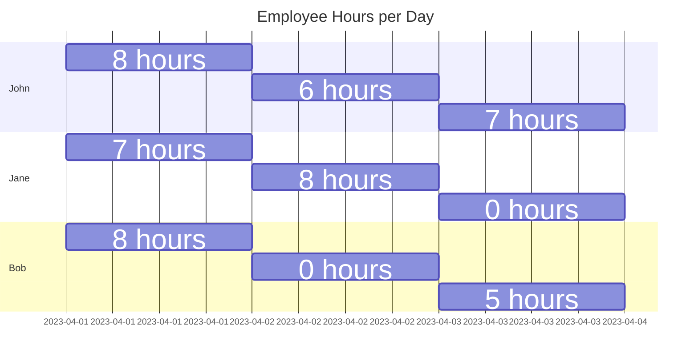
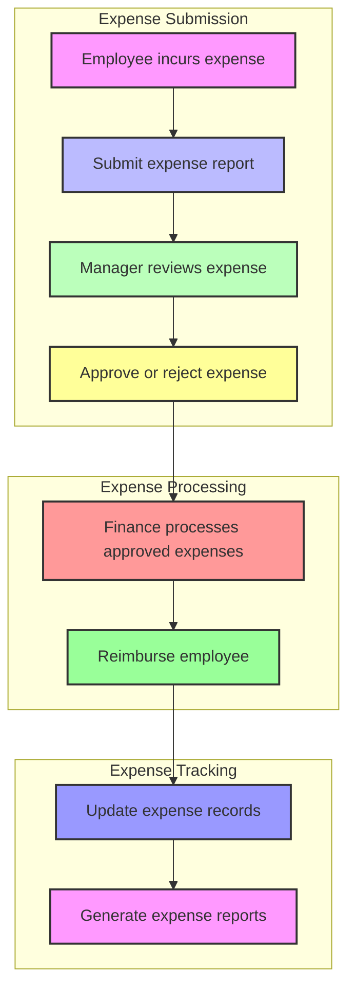

# Use Cases

There are many ways to use AI Agents, which can help us do everyday tasks like checking the weather, writing a travel itinerary, booking a hotel, doing deep research like places to stay, things to see, calling a cab in advance, auto inventory cycle count, automated purchase ordering, paying vendors, managing helpdesk, FAQ, manage customer service tickets, auto responding to email or helpdesk tickets, reconciling data, query HR Policy, writing simple code or making a to-do list, automated browsing like OpenAI Operators. We can even write code to control things like turning on and off an electric bulb.

There are many places where Industrial grade visual AI Agents can be used to watch for early indicators of precautionary measures. These include factories, roads, and other areas where we want to make sure things are working properly. By looking at data from these places, we can learn more about what is happening. This helps us take action before anything bad happens.

In this book, I will use AI Agents to address most of these examples, but some big jobs might need extra work to transform them.

Building sophisticated visual AI agents requires substantial computational resources, but the great news is that the core knowledge and processes remain consistent whether you're developing a simple AI agent or a complex, industrial-grade visual AI system.

In this book, we’ll kick things off by guiding you through the creation of AI agents designed for straightforward tasks. As you gain confidence and experience, we’ll build on that foundation, expanding your skills to tackle more advanced visual AI agents.

The key here is that the principles and techniques you master early on apply across the board—think of it as establishing a strong base that supports everything you’ll do as you progress to more intricate projects.

By starting simple and scaling up, you’ll develop the expertise needed to create powerful AI agents, all while relying on the same fundamental understanding.

No matter how small or big it is, we should understand the task very well before using AI Agents to automate it. 

One example is managing employee time and expenses in a company. Every big and small organization does this. If we want to make the whole process automatic, we can use AI Agents. But first, let's take some time to document everything and learn about how the business works and then set the expected results from AI Agents.

## Automate HR 
**Time sheets, Expense operations using 100% local open source technologies**

Most big companies spend a lot of time and money on helping employees manage their work hours and expenses.

This is important because it can save them a lot of money by reducing waste and fraud. However, managing this process is very time-consuming for both employees and HR departments.

To solve this problem, we're using AI to automate the task. We'll start with time management and then add expense tracking later because it involves receiving receipts and images.

Let's see an example of timesheet data.

**Employee TimeSheet Table**

| Employee | 2023-04-01 | 2023-04-02 | 2023-04-03 |
|----------|------------|------------|------------|
| John     | 8          | 6          | 7          |
| Jane     | 7          | 8          | 0          |
| Bob      | 8          | 0          | 5          |




### business process

```{mermaid}
graph TD

    subgraph TimeSheet Management

        A[Employee has PTOs earned] --> B[Floating holidays, weekends, chaos days]

        A --> C[Assigned tasks with hours]

        A --> D[Leave of absence requests]

        D --> E[Absence approvals]

        E --> F[Time off balance, worked hours]

        B --> F

        C --> F

        F --> G[Review time off balance]

        G --> H[Update PTOs earned]

        H --> A

    end

  

    subgraph Task Management

        C --> I[Task reassignment needed]

        I --> J[Reassign tasks to other employees]

        J --> C

    end

  

    style A fill:#f9f,stroke:#333,stroke-width:2px

    style B fill:#bbf,stroke:#333,stroke-width:2px

    style C fill:#bfb,stroke:#333,stroke-width:2px

    style D fill:#ff9,stroke:#333,stroke-width:2px

    style E fill:#f99,stroke:#333,stroke-width:2px

    style F fill:#9f9,stroke:#333,stroke-width:2px

    style G fill:#99f,stroke:#333,stroke-width:2px

    style H fill:#f9f,stroke:#333,stroke-width:2px

    style I fill:#ff9,stroke:#333,stroke-width:2px

    style J fill:#bfb,stroke:#333,stroke-width:2px

    classDef PTOManagement fill:#f3f4f6,stroke:#333,stroke-width:2px
    classDef TaskManagement fill:#e3f2fd,stroke:#333,stroke-width:2px
    
    class A,B,C,D,E,F,G,H,PTO Management
    
    class I,J,Task Management
```

**Employee Expense Table**

| Employee | Expense Type | Amount | Date |
|----------|-------------|--------|------------|
| Alice    | Travel      | $200   | 2023-04-05 |
| Alice    | Meals       | $50    | 2023-04-10 |
| Bob      | Supplies    | $100   | 2023-04-03 |
| Bob      | Office      | $75    | 2023-04-07 |
| Charlie  | Meals       | $30    | 2023-04-02 |
| Charlie  | Travel      | $150   | 2023-04-08 |
| Charlie  | Meals       | $40    | 2023-04-08 |

```{mermaid}
gantt
    title Employee Expense Table
    dateFormat YYYY-MM-DD
    
    section Alice
    Travel, $200 :2023-04-01, 2023-04-01
    Meals, $50 :2023-04-05, 2023-04-05
    
    section Bob
    Supplies, $100 :2023-04-07, 2023-04-07
    Office, $75 :2023-04-12, 2023-04-12
    
    section Charlie
    Meals, $30 :2023-04-15, 2023-04-15
    Travel, $150 :2023-04-20, 2023-04-20
    Meals, $40 :2023-04-25, 2023-04-25

```



### AI Agents Operation Tasks

#### manage time operations
1. auto timesheets
    - timesheets reminder
    - auto fill
    - delayed timesheets
    - audit timesheets
2. ask questions | chatbot
    - time off balance
    - time off request approval status
    - time spend analysis tools
3. HR manager | chatbot
    - open time card | invite timesheets
    - auto approval
    - assign tasks
    - employee taskforce card
    - department taskforce card
    - exception reports

```{mermaid}
gantt
    title Manage Time Ops
    dateFormat YYYY-MM-DD

    section Auto Timesheets
    Reminder      :2025-03-01, 5d
    Auto Fill     :2025-03-06, 5d
    Delayed       :2025-03-11, 5d
    Audit         :2025-03-16, 5d

    section Chatbot Queries
    Timeoff Bal   :2025-03-01, 5d
    Approval Stat :2025-03-06, 5d
    Time Analysis :2025-03-11, 5d

    section HR Manager
    Open Card     :2025-03-01, 5d
    Auto Approve  :2025-03-06, 5d
    Assign Tasks  :2025-03-11, 5d
    Emp Task Card :2025-03-16, 5d
    Dept Task Card:2025-03-21, 5d
    Exceptions    :2025
```

#### manage expense operations
1. auto expense fill
2. upload receipts | fill lines
2. ask questions 
    - expense balance
    - expense request approval status
    - reminder of unfilled expense
    - expense analysis tools
3. HR manager
    - open expense card | invite expense
    - auto approval
    - employee expense reports
    - department expense card
    - exception reports
    - Receipt fraud, waste audit
    - Receipt discount finder

```{mermaid}
gantt
    title Manage Expense Ops
    dateFormat YYYY-MM-DD

    section Auto Fill
    Auto Fill :2025-04-01, 5d

    section Upload Receipts
    Upload Receipts :2025-04-01, 5d

    section Ask Questions
    Exp Balance :2025-04-01, 5d
    Approval Stat :2025-04-06, 5d
    Unfilled Reminder :2025-04-11, 5d
    Analysis Tools :2025-04-16, 5d

    section HR Manager
    Open Card :2025-04-01, 5d
    Auto Approve :2025-04-06, 5d
    Emp Reports :2025-04-11, 5d
    Dept Card :2025-04-16, 5d
    Exceptions :2025-04-21, 5d
    Fraud Audit :2025-04-26, 5d
    Discount Finder :2025-05-01, 5d
```