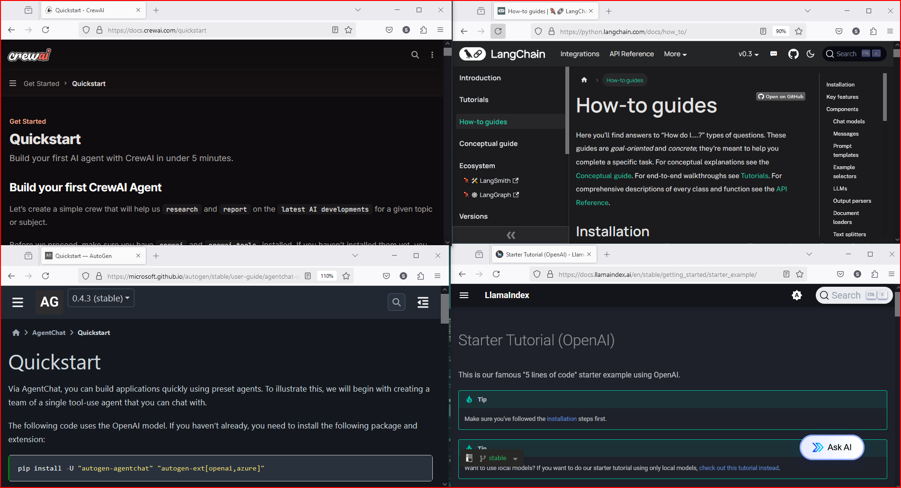

# Why AutoGen

why not CrewAI, LangChain, llamaIndex or Swarms or any other AI Agents framework, which one you should start with?

When I need to choose between different programming languages, frameworks, or tools, I follow a simple rule: I spend no more than 5 minutes reading the quick start guide.
and then I pick the one that triggers me to open a code editor and start coding right away.

I don't spend time on opinions or benchmark results, they don't inspire me to write code.

When you first start learning how to program, most tutorials only show you basic things like making a to-do list. But if you try to build a real app that works well, you'll realize that you need something more powerful than just shortcuts and easy-to-use tools. You can't just use any tools to make your app work forever in production.

To write AI Agents, I need something easy to use right away and then get more powerful and flexible soon.

It should be able to grow quickly and handle many features, including:
even driven programming, multi agent, multi tasks, multi systems working in a distributed parallel computing environment.

This tool should be like a framework rather than a programming library, not just a tool that does one thing and easy to learn. It should work well with new models, ideas and technologies that come up.

So, I'll use AutoGen 0.4. If it doesn't work out, I'll change my code anyway - that's what programmers do.

# AutoGen vs Semantics Kernel

First of the all, AutoGen and Semantics Kernels aren't competing framework and instead are complimentary.

## are they duplicates?
While there might be some overlap in their capabilities (both deal with AI agents), their target audiences and goals differ:
AutoGen is for researchers and innovators prototyping cutting-edge systems.

Semantic Kernel is for developers deploying stable, scalable AI solutions in production.

> Both AutoGen and Semantics Kernel are Microsoft sponsored.

`Think of AutoGen as a lab for experimentation and Semantic Kernel as the factory for implementation.`

Microsoft AutoGen 0.4 is a top choice for complex use cases involving multi-agent collaboration, asynchronous workflows, and scalability, thanks to its redesigned architecture and enterprise-friendly features. However, the best framework depends on your needs:

- For customization and prototyping, LangChain excels.
- For role-based teamwork, CrewAI is unmatched.
- For enterprise integration, Semantic Kernel shines.
- For data-centric tasks, LlamaIndex is the go-to.